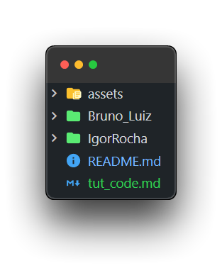
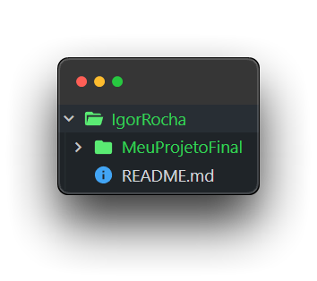

# Como criar um fork

## Importando o repositório

Clone o repositório ```https://github.com/devteam-tecno/projetos-trainees``` para sua máquina.

Você pode fazer isso no VSCode usando ```CTRL + SHIFT + P```, digitando ```git clone``` e colando o url ```https://github.com/devteam-tecno/projetos-trainees```

Salva esse repositório na sua área de trabalho mesmo.

## Criando sua pasta

Abra a pasta que foi criada e ela deve estar parecida com isso:



Crie uma pasta com o seu nome em CamelCase (todas as palavras juntas, com a primeira letra de cada em maiúscula). Caso você tenha feito em dupla, coloque o primeiro nome de cada integrante separado por underline ( _ )

Dentro da sua pasta, crie um arquivo ```README.md``` que vai ser a descrição do seu projeto e link para o GitHub Pages. Você pode usar [esse](/IgorRocha/README.md) como base.

Na mesma pasta, envie o arquivo do seu repositório. Deve ficar algo nesse estilo:



## Commitando e criando o Fork

Assim que você finalizar a descrição do projeto e colocar os seus arquivos na pasta, faça o commit e o push normal. Ele vai dar um erro e pedir pra você criar um fork


Assim que o fork for finalizado, você consegue acessar via [GitHub](https://github.com)

Agora você deve seguir as instruções [desse tutorial (Criando Pull Request)](./tut_nav.md#criando-pull-request)