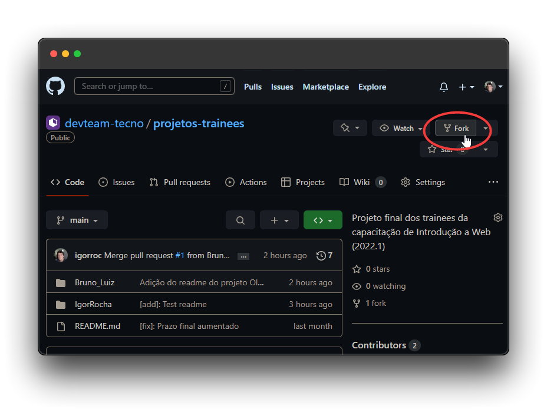
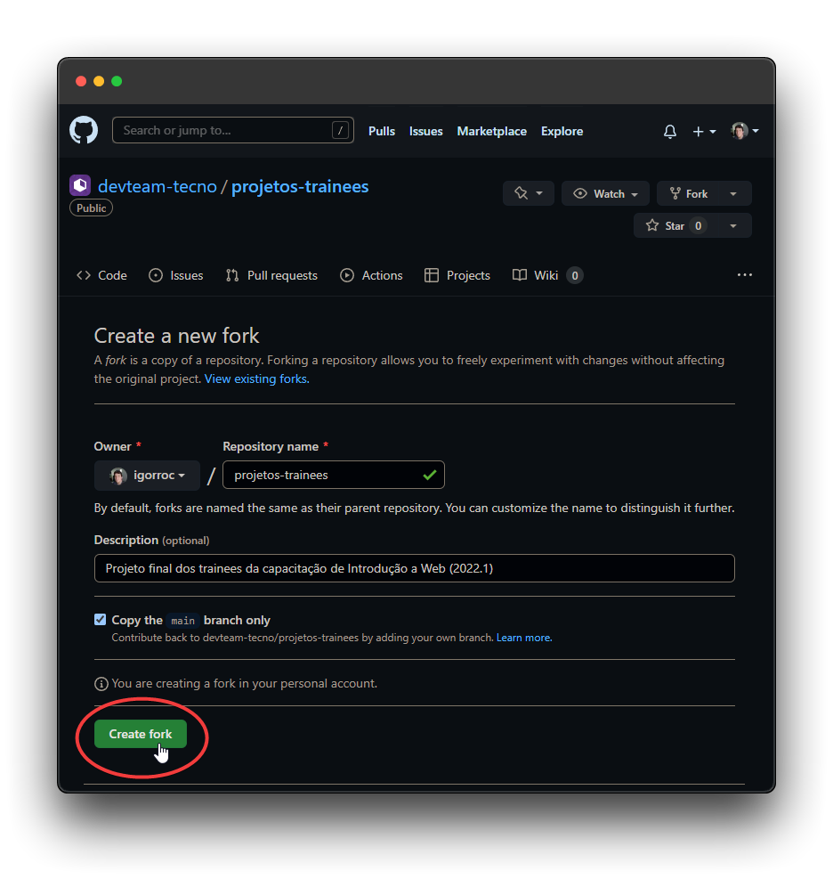
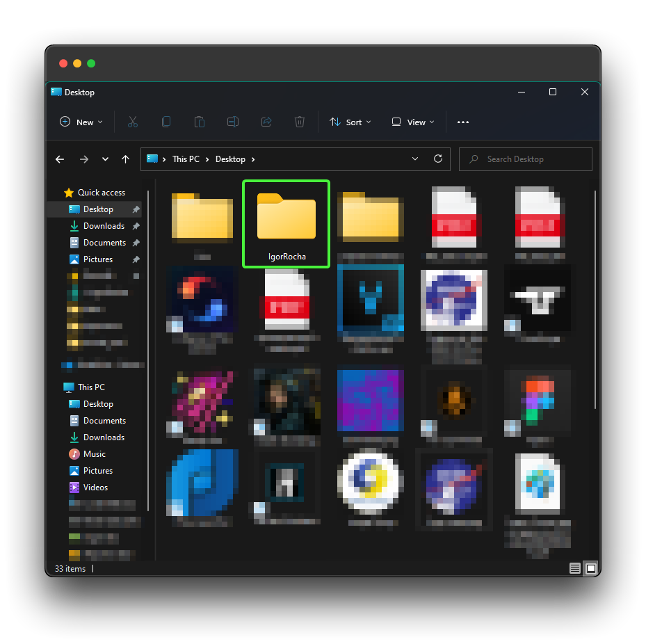
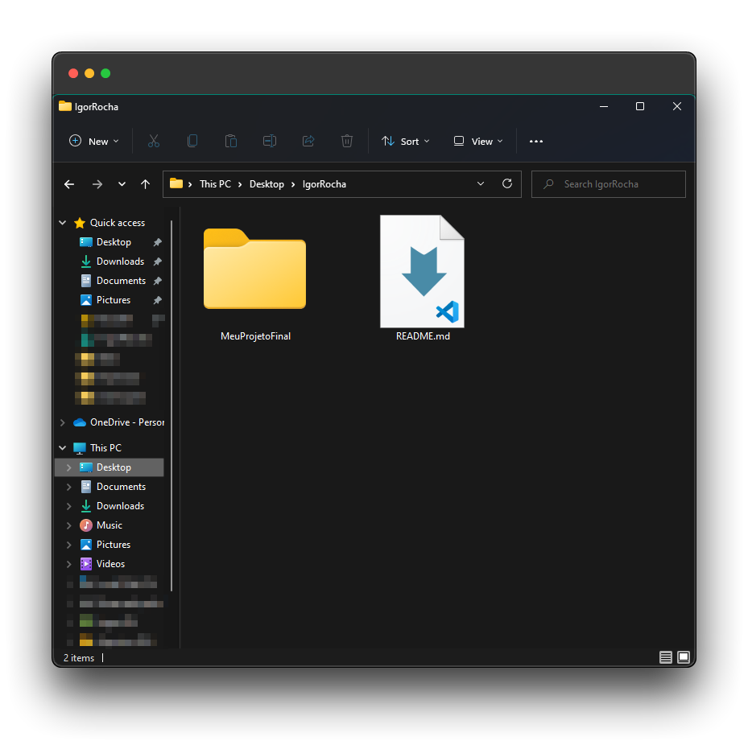
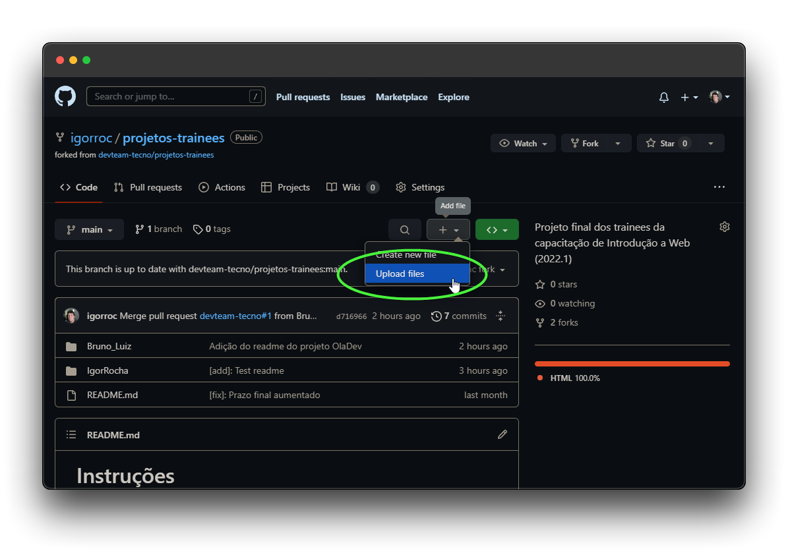
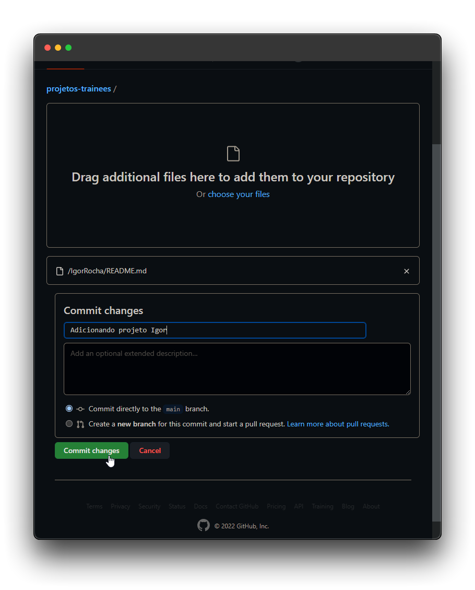
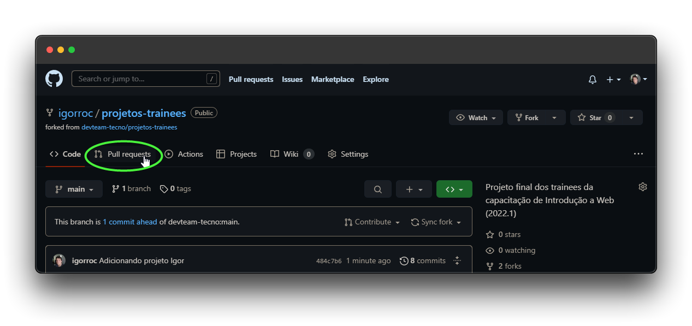
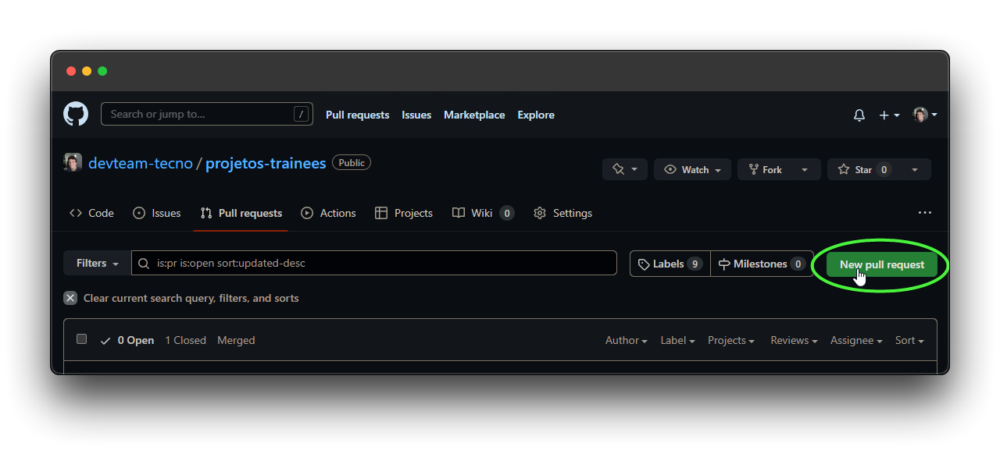
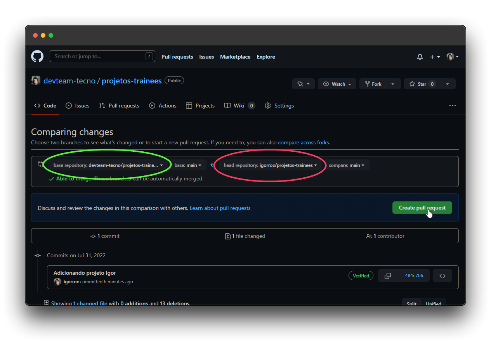
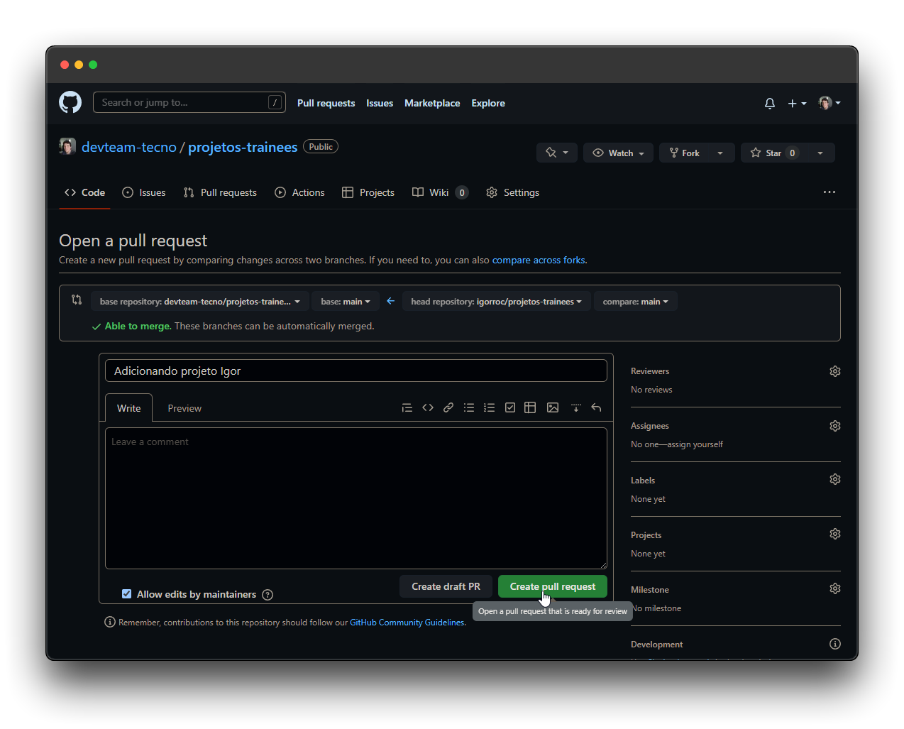

# Como criar um fork

## Acesse o repositório

Abra o [GitHub](https://github.com/devteam-tecno/projetos-trainees) no repositório ```https://github.com/devteam-tecno/projetos-trainees```.

Aperte o botão de [Fork](https://github.com/devteam-tecno/projetos-trainees/fork) e finalize.






## Criando sua pasta

Na sua área de trabalho, crie uma pasta com o seu nome em CamelCase (todas as palavras juntas, com a primeira letra de cada em maiúscula). Caso você tenha feito em dupla, coloque o primeiro nome de cada integrante separado por underline ( _ )



Dentro da sua pasta, crie um arquivo ```README.md``` que vai ser a descrição do seu projeto e link para o GitHub Pages. Você pode usar [esse](/IgorRocha/README.md) como base.

Na mesma pasta, envie os arquivos do seu repositório. Deve ficar algo nesse estilo:



## Commitando e criando o Fork

Assim que você finalizar a descrição do projeto e colocar os seus arquivos na pasta, faça o envio para o seu GitHub 
```https://github.com/SeuUsuario/projetos-trainees```






## Criando Pull Request

As alterações que você enviou ate agora estão no fork que você criou para sua conta. Para enviar ao repositório da Tecno, você precisa abrir um Pull Request.

Para isso, acesse o seu Fork, e vá em Pull Request:



Crie um novo Pull Request:



Confirme que o repositorio base (em verde, na esquerda) é o da Tecno [```devteam-tecno/projetos-trainees```] e que o repositorio head (em vermelho, na direita) é o seu [```SeuNome/projetos-trainees```]



Finalize o Pull Request e me me avisa pelo WhatsApp ou Discord!




